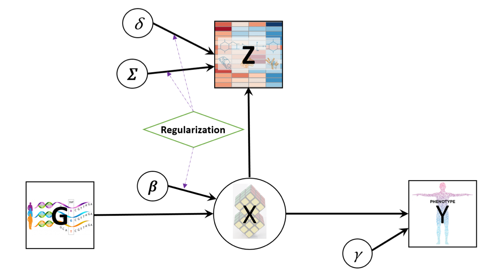
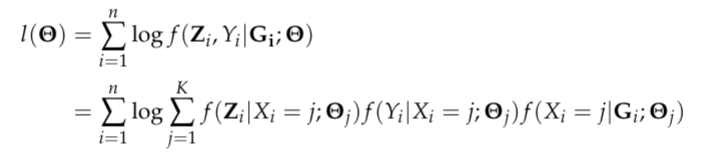
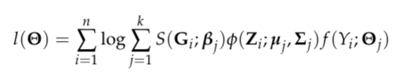
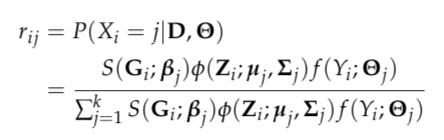
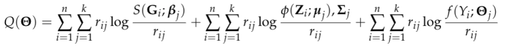
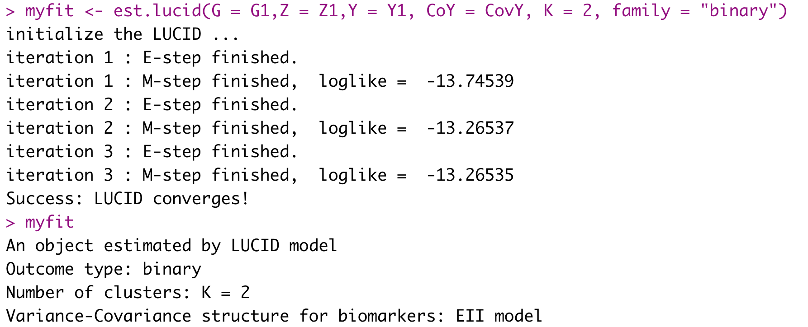
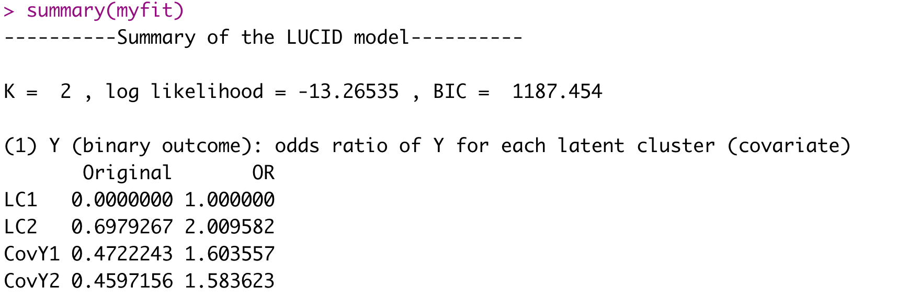
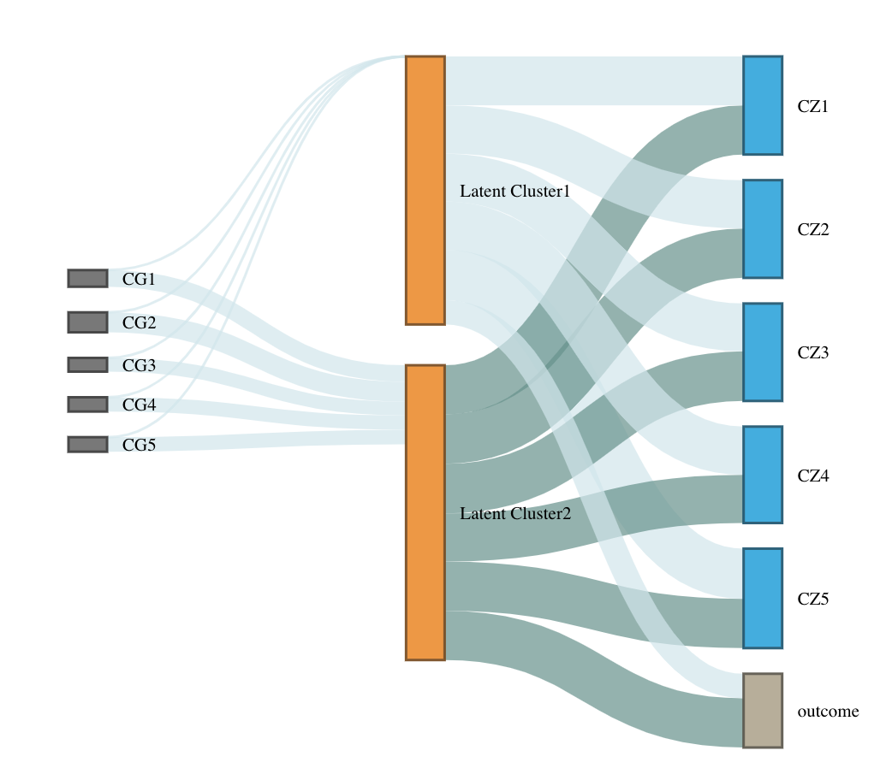
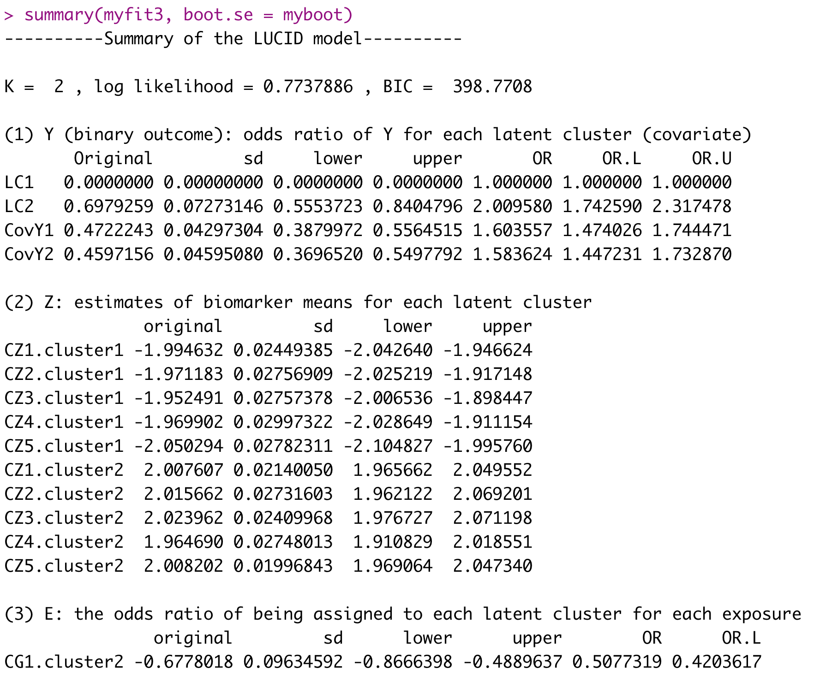

<!-- README.md is generated from README.Rmd. Please edit that file -->

```{r, include = FALSE}
knitr::opts_chunk$set(
  collapse = TRUE,
  comment = "#>",
  fig.path = "man/figures/README-",
  out.width = "100%"
)
```

## Introduction

The LUCIDus R package is an integrative tool to obtain a joint estimation of latent or unknown clusters/subgroups with multi-omics data and phenotypic traits. This package is an implementation for the novel statistical method proposed in the research paper "[A Latent Unknown Clustering Integrating Multi-Omics Data (LUCID) with Phenotypic Traits](https://doi.org/10.1093/bioinformatics/btz667)" published by the *Bioinformatics*. 

Multi-omics data combined with the phenotypic trait are integrated by jointly modeling their relationships through a latent cluster variable, which is illustrated by the directed acyclic graph (DAG) below. (A screenshot from [LUCID paper](https://doi.org/10.1093/bioinformatics/btz667))

```{r out.width="50%", echo=FALSE}

```

Let G be a n by p matrix with columns representing genetic features/environmental exposures, and rows being the observations; Z be a n by m matrix of standardized biomarkers and Y be a n-dimensional vector of disease outcome. By the DAG graph, it is further assumed that all three components above are linked by a categorical latent cluster variable X of K classes and with the conditional independence implied by the DAG, the general joint likelihood of the LUCID model can be formalized into

```{r echo=FALSE, out.width="50%"}

```

where Theta is a generic notation standing for parameters associated with each probability model. Additionally, we assume X follows a multinomial distribution conditioning on G, Z follows a multivariate normal distribution conditioning on X and Y follows a normal/Bernoulli (depending on the specific data structure of disease outcome) distribution conditioning on X. Therefore, the equation above can be finalized as

```{r echo=FALSE, out.width="40%"}

```

where S denotes the softmax function and phi denotes the probability density function (pdf) of the multivariate normal distribution.

To obtain the maximum likelihood estimates (MLE) of the model parameters, an EM algorithm is applied to handle the latent variable X. Denote the observed data as D, then the posterior probability of observation i being assigned to latent cluster j is expressed as

```{r echo=FALSE, out.width="35%"}

```

and the expectation of the complete log likelihood can be written as

```{r echo=FALSE, out.width="60%"}

```

At each iteration, in the E-step, compute the expectation of the complete data log likelihood by plugging in the posterior probability and then in the M-step, update the parameters by maximizing the expected complete likelihood function. Detailed derivations of the EM algorithm for LUCID can be found elsewhere.


## Installation

You can install the development version from [GitHub](https://github.com/) with:
```{r eval=FALSE}
install.packages("devtools")
devtools::install_github("Yinqi93/LUCIDus")
```

## Example

```{r eval=FALSE}
library(LUCIDus2)
```

The two main functions: `est.lucid()` and `boot.lucid()` are used for model fitting and estimation of SE of the model parameters. You can also achieve variable selection by setting tuning parameters in `def.lucid`. The model outputs can be summarized and visualized using `summary` and `plot` respectively. Predictions could be made with `pred`.

Estimating latent clusters with multi-omics data, missing values in biomarker data are allowed, and information in the outcome of interest can be integrated. For illustration, we use a testing dataset with 10 genetic features (5 causal) and 10 biomarkers (5 causal)

### Integrative clustering without feature selection
First, fit the model with `est.lucid`.
```{r eval=FALSE}
set.seed(10)
myfit <- est.lucid(G = G1,Z = Z1,Y = Y1, CoY = CovY, K = 2, family = "binary")
myfit
```

```{r out.width="80%", echo=FALSE}

```

Check the model features.
```{r eval=FALSE}
summary(myfit)
```
A summary of results start with this:
```{r out.width="80%", echo=FALSE}

```

Then visualize the results with Sankey diagram using `plot_lucid()`
```{r eval=FALSE}
plot(myfit)
```

```{r out.width="50%", echo=FALSE}
knitr::include_graphics("man/figures/Sankey1.png")
```


### Integrative clustering with feature selection
Run LUCID with tuning parameters and select informative features
```{r eval=FALSE}
set.seed(10)
myfit2 <- est.lucid(G = G1, Z = Z1, Y = Y1, CoY = CovY, K = 2, family = "binary", useY = FALSE, tune = def.tune(Select_Z = TRUE, Rho_Z_InvCov = 0.2, Rho_Z_CovMu = 90, Select_G = TRUE, Rho_G = 0.02))
selectG <- myfit2$select$selectG
selectZ <- myfit2$select$selectZ
```
Re-fit with selected features
```{r eval=FALSE}
set.seed(10)
myfit3 <- est.lucid(G = G1[, selectG], Z = Z1[, selectZ], Y = Y1, CoY = CovY, K = 2, family = "binary", useY = FALSE)
```
```{r eval=FALSE}
plot(myfit3)
```

```{r out.width="50%", echo=FALSE}

```


### Bootstrap method to obtain SEs for LUCID parameter estimates
```{r eval=FALSE}
set.seed(10)
myboot <- boot.lucid(G = G1[, selectG], Z = Z1[, selectZ], Y = Y1, CoY = CovY, model = myfit3, R = 50)
summary(myfit3, boot.se = myboot)
```
A detailed summary with 95% CI is provided as below.
```{r out.width="80%", echo=FALSE}

```

For more details, see documentations for each function in the R package.

## Built With

* [devtools](https://cran.r-project.org/package=devtools) - Tools to Make Developing R Packages Easier
* [roxygen2](https://cran.r-project.org/package=roxygen2) - In-Line Documentation for R

## Versioning

The current version is 1.0.0.

For the versions available, see the [Release](https://github.com/Yinqi93/LUCIDus/releases) on this repository. 

## Authors

* Yinqi Zhao

## License

This project is licensed under the GPL-2 License.

## Acknowledgments
* Cheng Peng, Ph.D.
* David V. Conti, Ph.D.
* Zhao Yang, Ph.D.
* USC IMAGE P1 Group