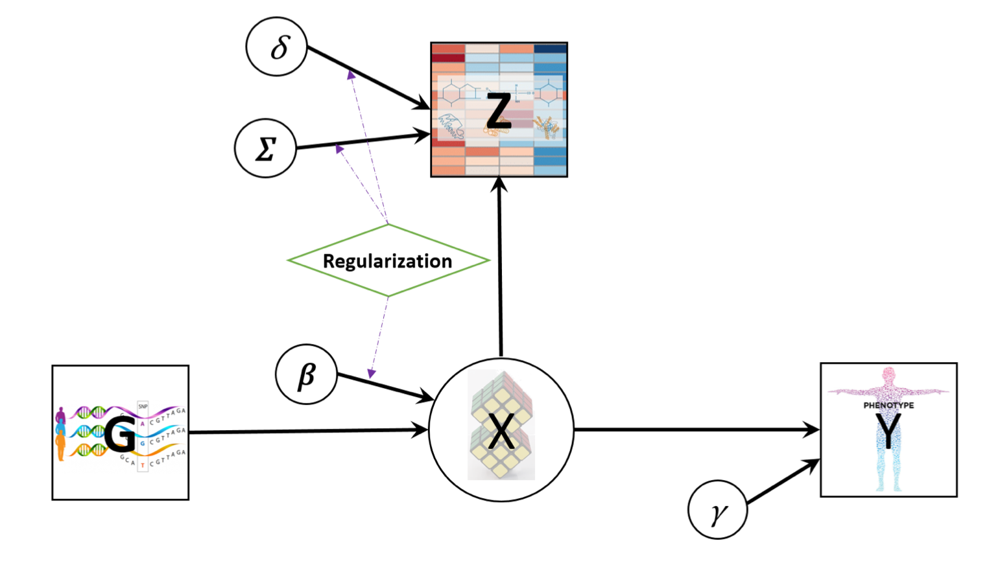
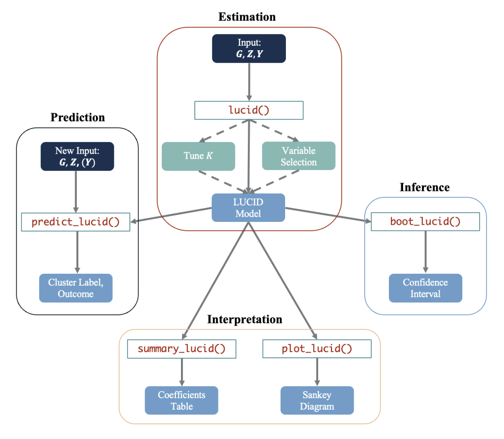
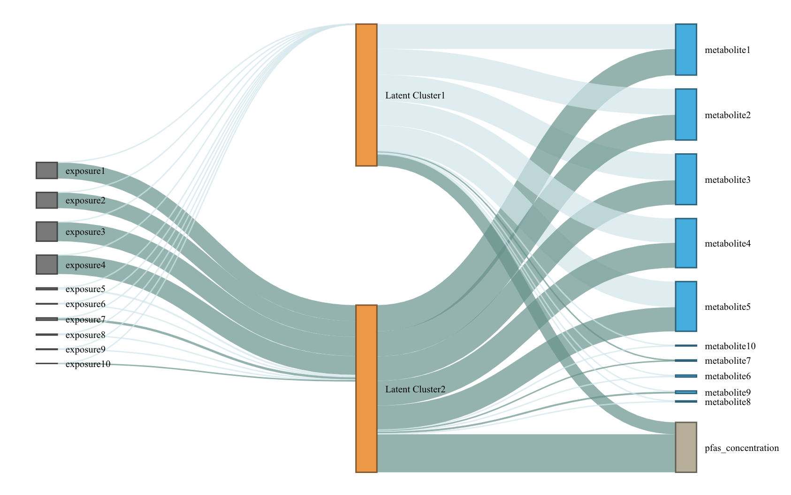

# LUCIDus: an R package to implement integrative clustering

## Introduction

Many studies are leveraging current technologies to obtain multiple
omics measurements on the same individuals. Guided by biology or the
temporal sequence of measurements, these studies often share a common
structure that relates long term exposures to intermediate measures
capturing transitional processes that ultimately result in an outcome.
In this context, we have previously introduced an integrative model to
estimate latent unknown clusters (LUCID) aiming to both distinguish
unique exposure effects and informative omic effects while jointly
estimating subgroups of individuals relevant to the outcome of interest
(Peng et al. 2020). **LUCIDus** is an R package to implement the LUCID
model. It provides an integrated clustering framework to researchers,
and has numerous downloads (around 20,000 times since it was first
introduced according to dlstats (Yu, 2022)). It has also been applied in
several environmental epidemiological studies (Jin et al., 2020;
Stratakis et al., 2020; Matta et al., 2022).

In this tutorial, we briefly review the statistical background of the
model and introduce the workflow of LUCIDus, including model fitting,
model selection, interpretation, inference, and prediction. Throughout,
we use a realistic but simulated dataset based on an ongoing study, the
Human Early Life Exposome study (HELIX) to illustrate the workflow

## Introduction to the LUCID model

Genetic/environmental exposures ($\mathbf{G}$), omics data
($\mathbf{Z}$) and outcome ($\mathbf{Y}$) are integrated by using a
latent cluster variable, which is illustrated by the directed acyclic
graph (DAG) below. (A screenshot from [the method paper for
LUCID](https://doi.org/10.1093/bioinformatics/btz667))



Let $\mathbf{G}$ be a $n \times p$ matrix with columns representing
genetic features/environmental exposures, and rows being the
observations; $\mathbf{Z}$ be a $n \times m$ matrix of standardized
omics data and $\mathbf{Y}$ be a $n$-dimensional vector of outcome.
According to the DAG, we assume that $\mathbf{G}$, $\mathbf{Z}$ and
$\mathbf{Y}$ are linked by a categorical latent variable $\mathbf{X}$,
consisting of $K$ categories. The DAG implies conditional independence.
The joint likelihood of the LUCID model is formulated as
$$\begin{aligned}
{l(\mathbf{\Theta})} & {= \sum\limits_{i = 1}^{n}\log f\left( \mathbf{Z}_{i},Y_{i}|\mathbf{G}_{\mathbf{i}};\mathbf{\Theta} \right)} \\
 & {= \sum\limits_{i = 1}^{n}\log\sum\limits_{j = 1}^{K}f\left( \mathbf{Z}_{i}|X_{i} = j;\mathbf{\Theta}_{j} \right)f\left( Y_{i}|X_{i} = j;\mathbf{\Theta}_{j} \right)f\left( X_{i} = j|\mathbf{G}_{i};\mathbf{\Theta}_{j} \right)}
\end{aligned}$$ where $\mathbf{\Theta}$ is a generic notation standing
for all parameters in LUCID. Additionally, we assume $\mathbf{X}$
follows a multinomial distribution conditioning on $\mathbf{G}$,
$\mathbf{Z}$ follows a multivariate normal distribution conditioning on
$\mathbf{X}$ and $\mathbf{Y}$ follows a Gaussian (for continuous
outcome) or Bernoulli (for binary outcome) distribution conditioning on
$\mathbf{X}$. As a result, the equation above is finalized as
$$\begin{array}{r}
{l(\mathbf{\Theta}) = \sum\limits_{i = 1}^{n}\log\sum\limits_{j = 1}^{k}S\left( \mathbf{G}_{i};{\mathbf{β}}_{j} \right)\phi\left( \mathbf{Z}_{i};{\mathbf{μ}}_{j},\mathbf{\Sigma}_{j} \right)f\left( Y_{i};\mathbf{\Theta}_{j} \right)}
\end{array}$$ where $S$ denotes the softmax function for multinomial
distribution and $\phi$ denotes the probability density function (pdf)
of the multivariate normal distribution.

Because $\mathbf{X}$ is not observed, we use the
Expectation-Maximization (EM) algorithm to obtain the maximum likelihood
estimates (MLE) of LUCID. We denote the observed data ($\mathbf{G}$,
$\mathbf{Z}$ and $\mathbf{Y}$) as $\mathbf{D}$. In the E-step, we
estimate responsibility below: $$\begin{aligned}
r_{ij} & {= P\left( X_{i} = j|\mathbf{D},\mathbf{\Theta} \right)} \\
 & {= \frac{S\left( \mathbf{G}_{i};{\mathbf{β}}_{j} \right)\phi\left( \mathbf{Z}_{i};{\mathbf{μ}}_{j},\mathbf{\Sigma}_{j} \right)f\left( Y_{i};\mathbf{\Theta}_{j} \right)}{\sum\limits_{j = 1}^{k}S\left( \mathbf{G}_{i};{\mathbf{β}}_{j} \right)\phi\left( \mathbf{Z}_{i};{\mathbf{μ}}_{j},\mathbf{\Sigma}_{j} \right)f\left( Y_{i};\mathbf{\Theta}_{j} \right)}}
\end{aligned}$$ The responsibility is interpreted as the posterior
probability of observation $i$ being assigned to latent cluster $j$
given the observed data $\mathbf{D}$.

In the M-step, we maximize the expectation of joint likelihood below, in
terms of $\mathbf{\Theta}$. $$\begin{array}{r}
{Q(\mathbf{\Theta}) = \sum\limits_{i = 1}^{n}\sum\limits_{j = 1}^{k}r_{ij}\log\frac{S\left( \mathbf{G}_{i};{\mathbf{β}}_{j} \right)}{r_{ij}} + \sum\limits_{i = 1}^{n}\sum\limits_{j = 1}^{k}r_{ij}\log\frac{\phi\left( \mathbf{Z}_{i};{\mathbf{μ}}_{j},\mathbf{\Sigma}_{j} \right)}{r_{ij}} + \sum\limits_{i = 1}^{n}\sum\limits_{j = 1}^{k}r_{ij}\log\frac{f\left( Y_{i};\mathbf{\Theta}_{j} \right)}{r_{ij}}}
\end{array}$$

For more statistical details, please refer to Peng (2020).

## General workflow



The LUCIDus package includes five main functions and two auxiliary
functions to implement the analysis framework based on LUCID. Brief
descriptions of each function are listed in the table below. Below we
describe the typical workflow of analyzing integrated data using the
LUCID model. The function [`lucid()`](../reference/lucid.md) is the
primary function in the package, which fits a LUCID model based on an
exposure matrix (argument `G`), omics data (argument `Z`), outcome data
(argument `Y`), the number of latent clusters (`K`; default is 2), and
the family of the outcome (argument `family`; default is “normal”). If a
vector of `K` and/or $L_{1}$ penalties are supplied,
[`lucid()`](../reference/lucid.md) will automatically conduct model
selection on number of clusters `K`, select informative variables in `G`
or `Z`, or both, and returns a LUCID model (an R object of class
“lucid”) with optimal `K` and selected variables in `G` and/or `Z`.
Several additional functions can then be applied to a fitted LUCID
object. [`summary_lucid()`](../reference/summary_lucid.md) summarizes
the fitted LUCID model by producing summary tables of parameter
estimation and interpretation. Visualization is performed via the
[`plot_lucid()`](../reference/plot_lucid.md) function to create a Sankey
diagram showing the interplay among the three components (`G`, `Z` and
`Y`). In addition, statistical inference can be accomplished for LUCID
by constructing confidence intervals (CIs) based on bootstrap
resampling. This is achieved by the function
[`boot_lucid()`](../reference/boot_lucid.md). Finally, predictions on
the cluster assignment and the outcome can be obtained by calling the
function [`predict_lucid()`](../reference/predict_lucid.md). In
practice, it might not be necessary to implement the entire workflow
above. For instance, if we have prior knowledge on the number of latent
clusters K, model selection for the number of clusters can be skipped.
If a given dataset has limited variables (for example, variables
selected based on biological annotations), then variable selection may
not be necessary. [`lucid()`](../reference/lucid.md) calls
[`est_lucid()`](../reference/est_lucid.md) and
[`tune_lucid()`](../reference/tune_lucid.md) in the backend. The two
workhorse functions are not normally called directly, but they can be
useful when user wants to look into model fitting process in more
details.

| Function                                           | Description                                                                                                                                                                                                                              |
|----------------------------------------------------|------------------------------------------------------------------------------------------------------------------------------------------------------------------------------------------------------------------------------------------|
| [`lucid()`](../reference/lucid.md)                 | Main function to fit LUCID models, specified by giving integrated data and a distribution of the outcome. It also conducts model selection and variable selection.                                                                       |
| [`summary_lucid()`](../reference/summary_lucid.md) | Create tables to summarize a LUCID model.                                                                                                                                                                                                |
| [`plot_lucid()`](../reference/plot_lucid.md)       | Visualize LUCID models through Sankey diagrams. It supports user-defined color palette.                                                                                                                                                  |
| [`boot_lucid()`](../reference/boot_lucid.md)       | Derive confidence intervals based on bootstrap resampling.                                                                                                                                                                               |
| `pred_lucid()`                                     | Predict latent clsuter and outcome using integrated data.                                                                                                                                                                                |
| [`est_lucid()`](../reference/est_lucid.md)         | A workhorse function to fit a LUCID model                                                                                                                                                                                                |
| [`tune_lucid()`](../reference/tune_lucid.md)       | A workhorse function to conduct variable and model selection. It fits LUCID models across the grid of tuning parameters, including number of latent clusters $K$ and regularization penalties. It returns the optimal model based on BIC |

## Fit LUCID model

We use [`lucid()`](../reference/lucid.md) function to fit LUCID model.

``` r
library(LUCIDus)
# use simulated data
G <- sim_data$G
Z <- sim_data$Z
Y_normal <- sim_data$Y_normal
Y_binary <- sim_data$Y_binary
cov <- sim_data$Covariate

# fit LUCID model with continuous outcome
fit1 <- lucid(G = G, Z = Z, Y = Y_normal, family = "normal", K = 2, seed = 1008)

# fit LUCID model with binary outcome
fit2 <- lucid(G = G, Z = Z, Y = Y_binary, family = "binary", K = 2, seed = 1008)

# fit LUCID model with covariates
fit3 <- lucid(G = G, Z = Z, Y = Y_binary, CoY = cov, family = "binary", K = 2, seed = 1008)
fit4 <- lucid(G = G, Z = Z, Y = Y_binary, CoG = cov, family = "binary", K = 2, seed = 1008)
```

User should be aware of option `useY`. By default, `useY = TRUE`, which
means we estimate the latent cluster using the information from
exposure, omics data and outcome (referred to as supervised LUCID).
Otherwise, by setting `useY = FALSE`, we only use exposure and omics
data to estimate the latent clusters (referred to as unsupervised
LUCID).

``` r
# unsupervised lucid
fit5 <- lucid(G = G, Z = Z, Y = Y_normal, family = "normal", K = 2, useY = FALSE, seed = 1008)
```

LUCID allows for flexibe geometric features of the latent cluster,
including volume, shape and orientation. User can use argument
`modelName` to specify the models. By default, LUCID uses a `VVV` model
without putting any restraints on the model shape. Other available
models can be found in
[`mclust::mclustModelNames`](https://mclust-org.github.io/mclust/reference/mclustModelNames.html)
under the section of multivariate mixture. If `modelName = NULL`, LUCID
will choose the model based on data.

``` r
# fit LUCID model with automatic selection on covariance models
fit6 <- lucid(G = G, Z = Z, Y = Y_normal, family = "normal", K = 2, modelName = NULL, seed = 1008)
# check the optimal model
fit6$modelName

# fit LUCID model with a specified covariance model
fit7 <- lucid(G = G, Z = Z, Y = Y_normal, family = "normal", K = 2, modelName = "EII", seed = 1008)
```

LUCID has two options for initializing the EM algorithm. The first
method (also the default method) uses `mclust` and regression to
initialize parameters. The second initialize EM algorithm by random
guess.

``` r
# initialize EM algorithm by mclust and regression
fit8 <- lucid(G = G, Z = Z, Y = Y_normal, family = "normal", K = 2, init_par = "mclust" , seed = 1008)

# initialize EM algorithm by random guess
fit9 <- lucid(G = G, Z = Z, Y = Y_normal, family = "normal", K = 2, init_par = "random" , seed = 1008)
```

## Interpreting LUCID model

[`summary_lucid()`](../reference/summary_lucid.md) returns a coefficient
table of LUCID. The table is divided into 3 parts: (1) association
between outcome and latent cluster; (2) association between latent
cluster and omics data; (3) association between exposure and latent
clsuter.

``` r
# summarize LUCID model
summary_lucid(fit1)
```

## Visualization of LUCID

We use a Sankey diagram to visualize LUCID model. In the Sankey diagram,
each node represents a variable in LUCID (exposure, omics data or
outcome), each line corresponds to an association between two variables.
The color of the line indicates the direction of association (by
default, dark blue refers to positive association while light blue
refers to negative association) and the width of line indicates the
magnitude of association (large effect corresponds to wider line). User
can specify color palette of Sankey diagram.

``` r
# visualze lucid model via a Snakey diagram
plot_lucid(fit1)
```



``` r
# change node color
plot_lucid(fit1, G_color = "yellow")
plot_lucid(fit1, Z_color = "red")

# change link color
plot_lucid(fit1, pos_link_color = "red", neg_link_color = "green")
```

## Regularization

LUCID uses regularization to select variables. Regularization is applied
to exposure and omics data separately. For variable selection for
exposures ($\mathbf{G}$), we apply lasso regression, which is

$$\beta_{lasso} = \arg\max\limits_{\beta}\{\sum\limits_{i = 1}^{N}\sum\limits_{j = 1}^{K}r_{ij}\log S(X_{i} = j\left| G_{i},\beta_{j}) - \lambda_{\beta}\sum\limits_{j = 1}^{K}\sum\limits_{l = 1}^{P} \right|\beta_{jl}|\}$$

For omics data, cluster specific means are updated by
$$\mu_{j,lasso} = \arg\max\limits_{\mu}\{\sum\limits_{i = 1}^{N}\sum\limits_{j = 1}^{K}r_{ij}\log\phi(Z_{i} = j\left| \mu_{j},\Sigma_{j}) - \lambda_{\mu}\sum\limits_{j = 1}^{k}\sum\limits_{l = 1}^{m} \right|\mu_{jl}|\}$$
Cluster specific variance-covariance matrices are updated via their
inverse matrices $W = \Sigma^{- 1}$. LUCID uses the graphical lasso
algorithm to optimaize the parameter below,
$$W_{j,lasso} = \arg\max\limits_{\mu}\{\sum\limits_{i = 1}^{N}\sum\limits_{j = 1}^{K}r_{ij}\left( det\left( W_{j} \right) - trace\left( S_{j}W_{j} \right) \right) - \lambda_{W}\sum\limits_{j = 1}^{k}\sum\limits_{l,o}\left| w_{j;l,o} \right|\}$$
where $S_{j}$ is the empirical estimation of variance-covariance matrix.

User should specify the penalties to arguments `Rho_G` (for exposures),
`Rho_Z_Mu` and `Rho_Z_Cov` (for omics data). We recommend to choose
penalties based on the ranges below: 1. `Rho_G`: 0 - 1 2. `Rho_Z_Mu`:
0 - 100 3. `Rho_Z_Cov`: 0 - 1 However, the ranges above are empirical
values based on simulation studies. User can try different values based
on their own datasets. In practice, user can pass a vector of penalties
to `lucid` and let `lucid` decide the optimal penalty.

``` r
# use LUCID model to conduct integrated variable selection
# select exposure
fit10 <- lucid(G = G, Z = Z, Y = Y_normal, CoY = NULL, family = "normal", K = 2, seed = 1008, Rho_G = 0.1)
fit11 <- lucid(G = G, Z = Z, Y = Y_normal, CoY = NULL, family = "normal", K = 2, seed = 1008, Rho_G = seq(0.01, 0.1, by = 0.01))

# select omics data
fit12 <- lucid(G = G, Z = Z, Y = Y_normal, CoY = NULL, family = "normal", K = 2, seed = 1008, Rho_Z_Mu = 90, Rho_Z_Cov = 0.1, init_par = "random")
fit13 <- lucid(G = G, Z = Z, Y = Y_normal, CoY = NULL, family = "normal", K = 2, seed = 1008, Rho_Z_Mu = seq(10, 50, by = 10), Rho_Z_Cov = 0.5, init_par = "random", verbose_tune = TRUE)
```

## Model selection

We use Bayesian Information Criteria (BIC) to choose the optimal number
of latent clusters ($K$) for LUCID model.

``` r
# tune lucid over a grid of K (note this function may take time to run)
tune_lucid <- lucid(G = G, Z = Z, Y = Y_normal, K =2:5)
```

## Inference

LUCID uses bootstrap to derive confidence interval for parameters, given
a certain confidence interval.

``` r
# conduct bootstrap resampling
boot1 <- boot_lucid(G = G, Z = Z, Y = Y_normal, model = fit1, R = 100)

# use 90% CI
boot2 <- boot_lucid(G = G, Z = Z, Y = Y_normal, model = fit1, R = 100, conf = 0.9)
```

Diagnostic plot for bootstrap samples is created by

``` r
# check distribution for bootstrap replicates of the variable of interest
plot(boot1$bootstrap, 1)
```

## Incorporating missing omics data

The latest version of LUCID allows missingness in omics data. We
consider 2 missing patterns in omics data: (1) list-wise missing pattern
that only a subset of observations have measured omics data and (2)
sporadic missing pattern that missingness is completely at random. We
implement a likelihood partition for (1) and an integrated imputation
based EM algorithm for (2).

``` r
# fit LUCID model with block-wise missing pattern in omics data
Z_miss_1 <- Z
Z_miss_1[sample(1:nrow(Z), 0.3 * nrow(Z)), ] <- NA
fit14 <- lucid(G = G, Z = Z_miss_1, Y = Y_normal, family = "normal", K = 2)

# fit LUCID model with sporadic missing pattern in omics data
Z_miss_2 <- Z
index <- arrayInd(sample(length(Z_miss_2), 0.3 * length(Z_miss_2)), dim(Z_miss_2))
Z_miss_2[index] <- NA
fit15 <- lucid(G = G, Z = Z_miss_2, Y = Y_normal, family = "normal", K = 2, seed = 1008) 

# check the imputed omics dataset
head(fit15$Z)
```
