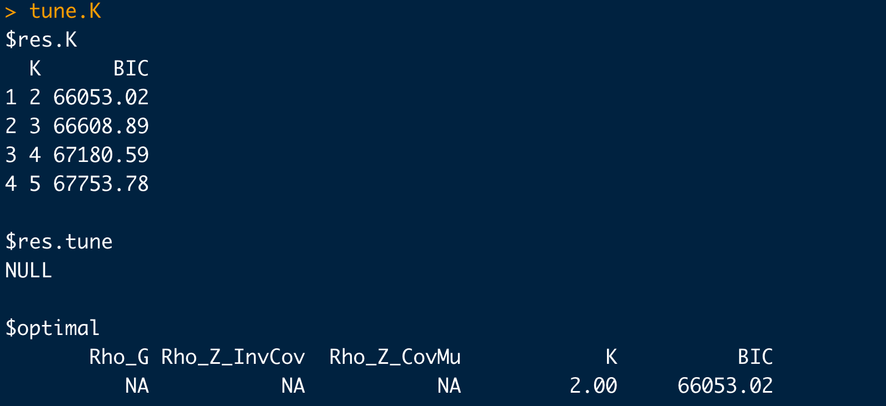
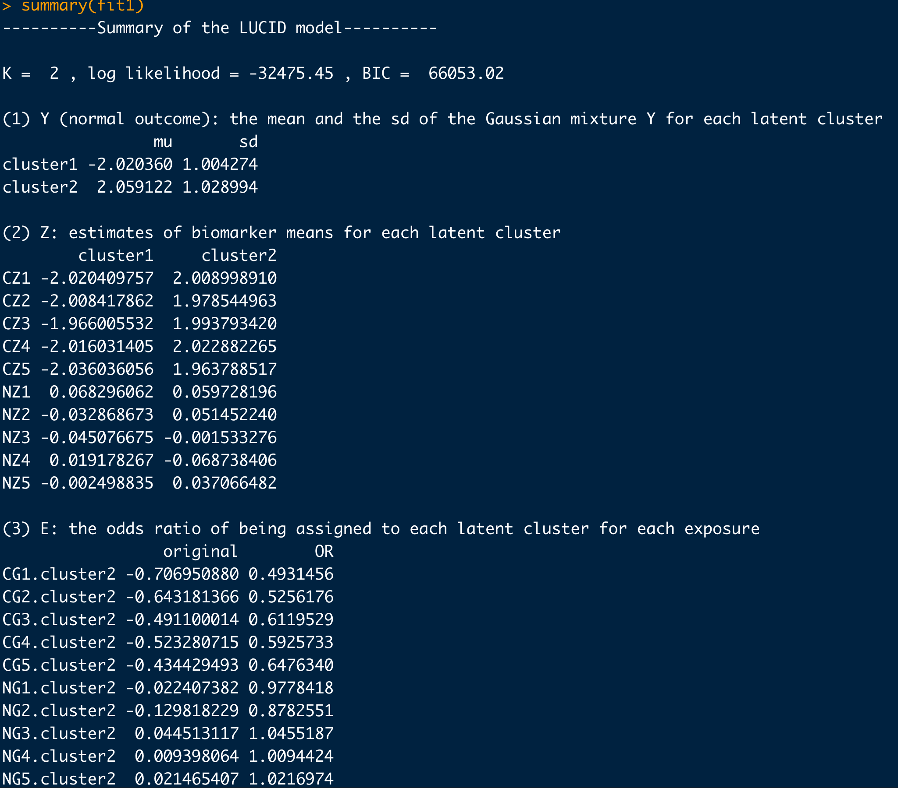
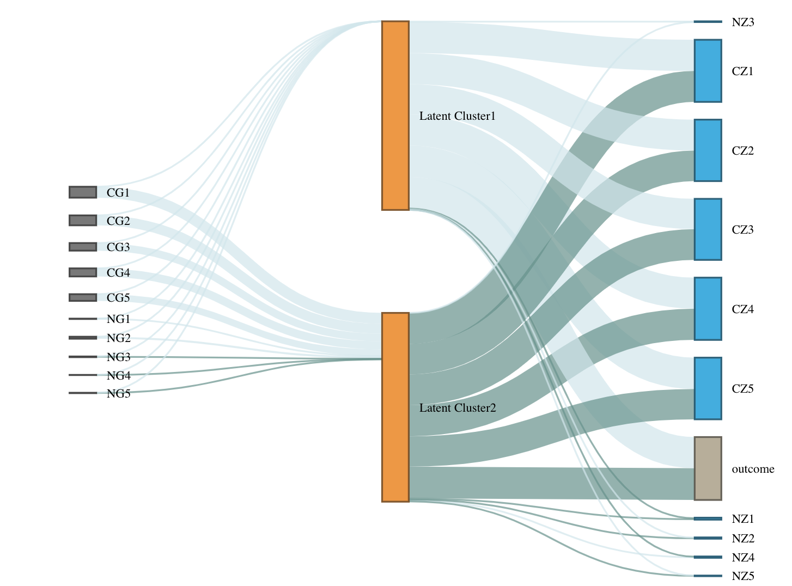
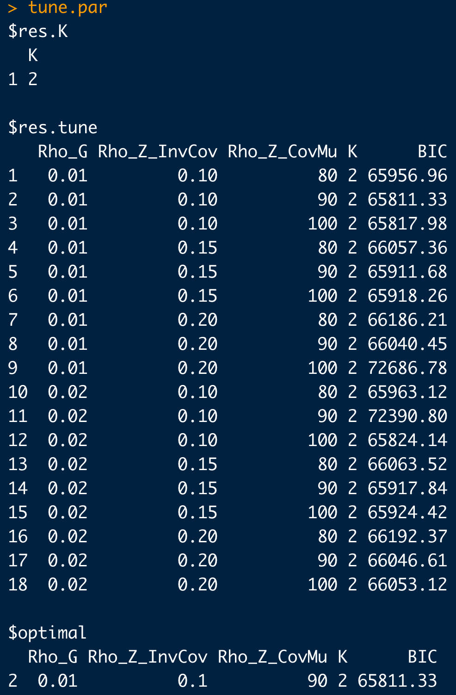
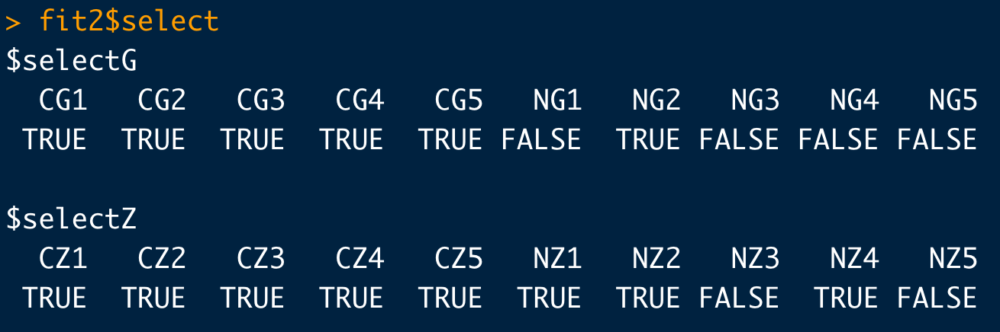
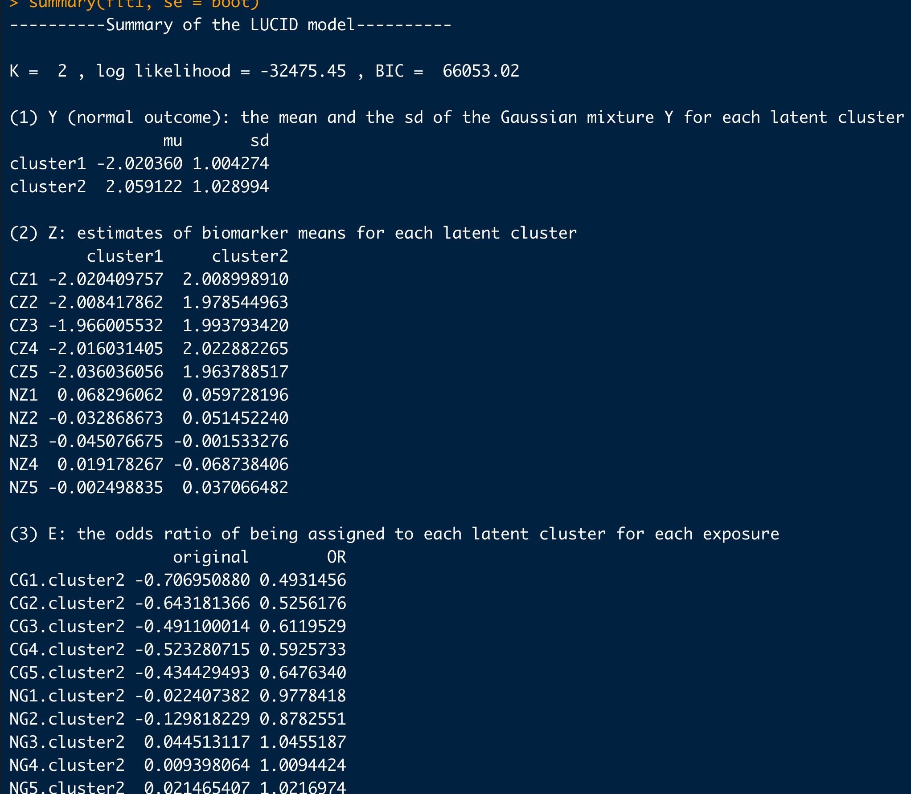

```{r setup, include = FALSE}
knitr::opts_chunk$set(
  collapse = TRUE,
  comment = "#>"
)
library(LUCIDus)
```

## About LUCIDus Package

The **LUCIDus** package is aiming to provide researchers in the genetic epidemiology community with an integrative tool in R to obtain a joint estimation of latent or unknown clusters/subgroups with multi-omics data and phenotypic traits. 

This package is an implementation for the novel statistical method proposed in the research paper "A Latent Unknown Clustering Integrating Multi-Omics Data (LUCID) with Phenotypic Traits^[https://doi.org/10.1093/bioinformatics/btz667]" published by the *Bioinformatics*. LUCID improves the subtype classification which leads to better diagnostics as well as prognostics and could be the potential solution for efficient targeted treatments and successful personalized medicine.

## Introduction to the LUCID (Latent Unknown Clustering with Integrated Data)
Multi-omics data combined with the phenotypic trait are integrated by jointly modeling their relationships through a latent cluster variable, which is illustrated by the directed acyclic graph (DAG) below. (A screenshot from [LUCID papaer](https://doi.org/10.1093/bioinformatics/btz667))

```{r out.width="50%", echo=FALSE}
knitr::include_graphics("DAG.png")
```

Let $\mathbf{G}$ be a $n \times p$ matrix with columns representing genetic features/environmental exposures, and rows being the observations; $\mathbf{Z}$ be a $n \times m$ matrix of standardized biomarkers and $\mathbf{Y}$ be a $n$-dimensional vector of disease outcome. By the DAG graph, it is further assumed that all three components above are linked by a categorical latent cluster variable $\mathbf{X}$ of $K$ classes and with the conditional independence implied by the DAG, the general joint likelihood of the LUCID model can be formalized into
\begin{equation}
    \begin{aligned}
    l(\mathbf{\Theta}) & = \sum_{i = 1}^n\log f(\mathbf{Z}_i, Y_i|\mathbf{G_i}; \mathbf{\Theta}) \\
        & = \sum_{i = 1}^n \log \sum_{j = 1}^K f(\mathbf{Z}_i|X_i = j; \mathbf{\Theta}_j) f(Y_i|X_i = j; \mathbf{\Theta}_j) f(X_i = j|\mathbf{G}_i; \mathbf{\Theta}_j)
    \end{aligned}
\end{equation}
where $\mathbf{\Theta}$ is a generic notation standing for parameters associated with each probability model. Additionally, we assume $\mathbf{X}$ follows a multinomial distribution conditioning on $\mathbf{G}$, $\mathbf{Z}$ follows a multivariate normal distribution conditioning on $\mathbf{X}$ and $\mathbf{Y}$ follows a normal/Bernoulli (depending on the specific data structure of disease outcome) distribution conditioning on $\mathbf{X}$. Therefore, the equation above can be finalized as
\begin{equation}
    \begin{aligned}
         l(\mathbf{\Theta}) = \sum_{i = 1}^n \log \sum_{j = 1}^k S(\mathbf{G}_i; \boldsymbol{\beta}_j) \phi(\mathbf{Z}_i; \boldsymbol{\mu}_j, \boldsymbol{\Sigma}_j)f(Y_i;\mathbf{\Theta}_j)
    \end{aligned}
\end{equation}
where $S$ denotes the softmax function and $\phi$ denotes the probability density function (pdf) of the multivariate normal distribution.

To obtain the maximum likelihood estimates (MLE) of the model parameters, an EM algorithm is applied to handle the latent variable $\mathbf{X}$. Denote the observed data as $\mathbf{D}$, then the posterior probability of observation $i$ being assigned to latent cluster $j$ is expressed as
\begin{equation}
    \begin{aligned}
        r_{ij} & = P(X_i = j|\mathbf{D}, \mathbf{\Theta}) \\
            & = \frac{S(\mathbf{G}_i; \boldsymbol{\beta}_j) \phi(\mathbf{Z}_i; \boldsymbol{\mu}_j, \boldsymbol{\Sigma}_j)f(Y_i;\mathbf{\Theta}_j)}{\sum_{j = 1}^k S(\mathbf{G}_i; \boldsymbol{\beta}_j) \phi(\mathbf{Z}_i; \boldsymbol{\mu}_j, \boldsymbol{\Sigma}_j)f(Y_i;\mathbf{\Theta}_j)}
    \end{aligned}
\end{equation}
and the expectation of the complete log likelihood can be written as
\begin{equation}
    \begin{aligned}
        Q(\mathbf{\Theta}) = \sum_{i = 1}^n\sum_{j = 1}^k r_{ij}\log\frac{S(\mathbf{G}_i; \boldsymbol{\beta}_j)}{r_{ij}} + \sum_{i = 1}^n\sum_{j = 1}^k r_{ij}\log\frac{\phi(\mathbf{Z}_i; \boldsymbol{\mu}_j), \boldsymbol{\Sigma}_j}{r_{ij}} + \sum_{i = 1}^n\sum_{j = 1}^k r_{ij}\log\frac{f(Y_i; \boldsymbol{\Theta}_j)}{r_{ij}}
    \end{aligned}
\end{equation}
At each iteration, in the E-step, compute the expectation of the complete data log likelihood by plugging in the posterior probability and then in the M-step, update the parameters by maximizing the expected complete likelihood function. Detailed derivations of the EM algorithm for LUDID can be found elsewhere.

# Framework to Fit the LUCID Model
The new version of *LUCIDus* package (ver 2.0.0) updates all the functions in the previous version and use *Mclust* function to initialize the algorithm to produce a more stable estimation. Although it is not backward compatible, it provides users with a more friendly model fitting framework and tables of estimates which are easy to interpret. The main functions in *LUCIDus* 2.0.0 are

| Function | Description |
|-------|------|
| `est.lucid()`|Estimate latent clusters using multi-omics data with/without the outcome of interest, and producing an lucid object; missing values in biomarker data (Z) are allowed| 
|`boot.lucid()`|Inference about the parameters of LUCID model based on bootstrap resampling method|   
|`summary()`|Summarize the results of LUCID model estimated by `est.lucid()`. It presents the results in a nice table with detailed explanation for parameters| 
|`plot()`|Use a Sankey diagram to visualize the LUCID model|
|`predict()`|Predict the outcome based on a fitted LUCID model given new genetic data and biomarkers|

Here, we use a simulated data set in the LUCID package to illustrate the framework of fitting LUCID model. The data contains 10 genetic features (5 causal, 5 non-causal), 10 biomarkers (5 causal, 5 non-causal), and a continuous outcome.

### Identify the number of latent clusters.
The first thing of fitting LUCID model is to identify the potential latent cluster number. Bayesian Information Criteria (BIC) is commonly used to compare and choose a group of non-nested models. Therefore we adapt the BIC to decide the number of latent clusters for LUCID. We can use `tune.lucid()` for this analysis.
```{r eval=FALSE}
set.seed(1)
tune.K <- tune.lucid(G = G2, Z = Z2, Y = Y2, K = 2:5)
tune.K
```

```{r out.width="80%"}

```

The function will return a list. `list$res.K` lists a series of models together with their BICs. `list$optimal` gives you the answer to the best K. Here, the model with K = 2 has the lowest BIC (66053.02) and hence we decide the optimal K to be 2.

### Fit the LUCID model
We use `est.lucid()` function to fit the model. `useY` is an option to be taken good care of. By default, `useY = TRUE`, which means we're interested in estimating the latent structure of the data and use the information of the outcome to cluster. On the other hand, if the primary question is to test the association of the cluster to outcome we should set it to `FALSE` since we do not want to bias the estimation of clusters by including the outcome in the estimation. Here is an example which focus on the estimation of the clustering.
```{r eval=FALSE}
fit1 <- est.lucid(G = G2, Z = Z2, Y = Y2, K = 2)
```

Then use `summary()` to display the model parameters.
```{r eval=FALSE}
summary(fit1)
```
```{r}

```


For a better understanding of the model, we can visualize the LUCID model by `plot()`.
```{r eval=FALSE}
plot(fit1)
```

```{r out.width="50%"}

```

### Variable Selection Procedure
As we can see from the table and the Sankey diagram, many genetic effects and biomarker effects are almost 0. To follow the principle of parsimony, it's reasonable to conduct a variable selection proedcure to achieve a simpler model. There are 3 tuning parameters in the variable selection. `Rho_G` is the penalty for genetic features and `Rho_InvCov` and `Rho_CovMu` are the penalties for biomarkers. To choose the best combination of tuning parameters, we perform a grid search and use BIC to identify the optimal choice. Here is an example of search 18 combinations.
```{r eval=FALSE}
set.seed(2)
tune.par <- tune.lucid(G = G2, Z = Z2, Y = Y2, family = "normal", K = 2,
                      Rho_G = c(0.01, 0.02),
                      Rho_Z_InvCov =c(0.1, 0.15,  0.2),
                      Rho_Z_CovMu = seq(80, 100, by = 10))
tune.par
```
```{r out.width="80%"}

```


The best combination is Rho_G = 0.01, Rho_Z_InvCov = -.1 and Rho_Z_CovMu = 90. Next, refit the model with penalties.
```{r eval=FALSE}
fit2 <- est.lucid(G = G2, Z = Z2, Y = Y2, K = 2, tune = def.tune(Rho_G = 0.01, Rho_Z_InvCov = 0.1, Rho_Z_CovMu = 90, Select_G = TRUE, Select_Z = TRUE))
```

Let's check the variables selected by LUCID.
```{r eval=FALSE}
fit2$select
```

```{r out.width="80%"}

```

Not all the non-significant variables are selected. In practice, we could try slightly increase the penalties to achieve better variable selection results.

### Inference on Parameters
It's hard to derive the asymptotic distribution of the estimates of LUCID. Thus we use a bootstrap method to do inference on parameters. It is realized by the function `boot.lucid`. Let's try bootstrap on model 1.
```{r eval=FALSE}
boot <- boot.lucid(G = G2, Z = Z2, Y = Y2, model = fit1, R = 100)
```

We can add boostrap SE and 95% CI to the summary table by specifying the option `se`.
```{r eval = FALSE}
summary(fit1, se = boot)
```

```{r out.width="80%"}

```


## Acknowledgments
- Cheng Peng, Ph.D.
- David V. Conti, Ph.D.
- Zhao Yang, Ph.D.
- USC IMAGE Group^[Supported by the National Cancer Institute at the National Institutes of Health Grant P01 CA196569]
