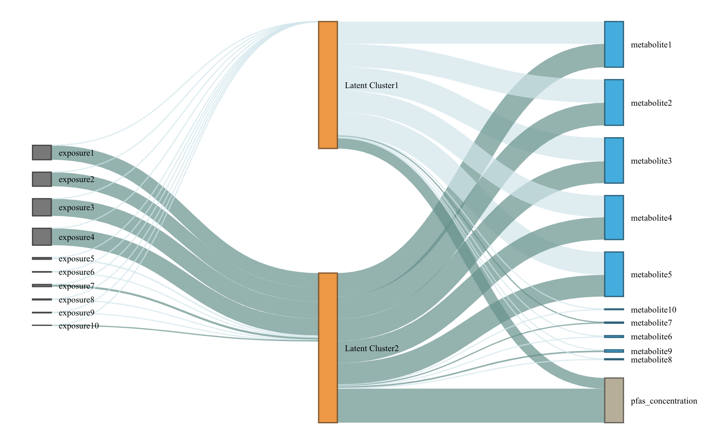

```{r setup, include = FALSE}
knitr::opts_chunk$set(
  collapse = TRUE,
  comment = "#>"
)
library(LUCIDus)
```

## About the LUCIDus R package

Peng et al. proposed an integrative model called Latent Unknown Clustering Integrating omics Data (LUCID) (Peng et al. 2020). LUCID jointly estimates latent unknown clusters in multi-omics data and relate the latent clusters to the outcome of interest. They demonstrated performance of LUCID through extensive simulation studies and real data applications to highlight the integration of genomic, exposomic and metabolomic data. LUCID provides an integrated clustering framework to researchers, has numerous downloads (18,000 times since it was first introduced according to **dlstats**), and has been applied in several environmental epidemiological studies.

The **LUCIDus** R package implements integrative analysis of mulit-view data using the LUCID model. The toolbox of **LUCIDus** contains estimation, prediction, visualization, model selection and inference. It also allows missingness in omics data and adjustment for covariates.

## Introduction to the LUCID model

Genetic/environmental exposures ($\mathbf{G}$), omics data ($\mathbf{Z}$) and outcome ($\mathbf{Y}$) are integrated by using a latent cluster variable, which is illustrated by the directed acyclic graph (DAG) below. (A screenshot from [the method paper for LUCID](https://doi.org/10.1093/bioinformatics/btz667))

```{r out.width="70%", echo=FALSE}
knitr::include_graphics("DAG.png")
```

Let $\mathbf{G}$ be a $n \times p$ matrix with columns representing genetic features/environmental exposures, and rows being the observations; $\mathbf{Z}$ be a $n \times m$ matrix of standardized omics data and $\mathbf{Y}$ be a $n$-dimensional vector of outcome. According to the DAG, we assume that $\mathbf{G}$, $\mathbf{Z}$ and $\mathbf{Y}$ are linked by a categorical latent variable $\mathbf{X}$, consisting of $K$ categories. The DAG implies conditional independence. The joint likelihood of the LUCID model is formulated as
\begin{equation}
    \begin{aligned}
    l(\mathbf{\Theta}) & = \sum_{i = 1}^n\log f(\mathbf{Z}_i, Y_i|\mathbf{G_i}; \mathbf{\Theta}) \\
        & = \sum_{i = 1}^n \log \sum_{j = 1}^K f(\mathbf{Z}_i|X_i = j; \mathbf{\Theta}_j) f(Y_i|X_i = j; \mathbf{\Theta}_j) f(X_i = j|\mathbf{G}_i; \mathbf{\Theta}_j)
    \end{aligned}
\end{equation}
where $\mathbf{\Theta}$ is a generic notation standing for all parameters in LUCID. Additionally, we assume $\mathbf{X}$ follows a multinomial distribution conditioning on $\mathbf{G}$, $\mathbf{Z}$ follows a multivariate normal distribution conditioning on $\mathbf{X}$ and $\mathbf{Y}$ follows a Gaussian (for continuous outcome) or Bernoulli (for binary outcome) distribution conditioning on $\mathbf{X}$. As a result, the equation above is finalized as \begin{equation}
    \begin{aligned}
         l(\mathbf{\Theta}) = \sum_{i = 1}^n \log \sum_{j = 1}^k S(\mathbf{G}_i; \boldsymbol{\beta}_j) \phi(\mathbf{Z}_i; \boldsymbol{\mu}_j, \boldsymbol{\Sigma}_j)f(Y_i;\mathbf{\Theta}_j)
    \end{aligned}
\end{equation} 
where $S$ denotes the softmax function for multinomial distribution and $\phi$ denotes the probability density function (pdf) of the multivariate normal distribution.

Because $\mathbf{X}$ is not observed, we use the Expectation-Maximization (EM) algorithm to obtain the maximum likelihood estimates (MLE) of LUCID. We denote the observed data ($\mathbf{G}$, $\mathbf{Z}$ and $\mathbf{Y}$) as $\mathbf{D}$. In the E-step, we estimate responsibility below:
\begin{equation}
    \begin{aligned}
        r_{ij} & = P(X_i = j|\mathbf{D}, \mathbf{\Theta}) \\
            & = \frac{S(\mathbf{G}_i; \boldsymbol{\beta}_j) \phi(\mathbf{Z}_i; \boldsymbol{\mu}_j, \boldsymbol{\Sigma}_j)f(Y_i;\mathbf{\Theta}_j)}{\sum_{j = 1}^k S(\mathbf{G}_i; \boldsymbol{\beta}_j) \phi(\mathbf{Z}_i; \boldsymbol{\mu}_j, \boldsymbol{\Sigma}_j)f(Y_i;\mathbf{\Theta}_j)}
    \end{aligned}
\end{equation} 
The responsibility is interpreted as the posterior probability of observation $i$ being assigned to latent cluster $j$ given the observed data $\mathbf{D}$.

In the M-step, we maximize the expectation of joint likelihood below, in terms of $\mathbf{\Theta}$.
\begin{equation}
    \begin{aligned}
        Q(\mathbf{\Theta}) = \sum_{i = 1}^n\sum_{j = 1}^k r_{ij}\log\frac{S(\mathbf{G}_i; \boldsymbol{\beta}_j)}{r_{ij}} + \sum_{i = 1}^n\sum_{j = 1}^k r_{ij}\log\frac{\phi(\mathbf{Z}_i; \boldsymbol{\mu}_j, \boldsymbol{\Sigma}_j)}{r_{ij}} + \sum_{i = 1}^n\sum_{j = 1}^k r_{ij}\log\frac{f(Y_i; \boldsymbol{\Theta}_j)}{r_{ij}}
    \end{aligned}
\end{equation} 
Details of the EM algorithm for LUDID can be found in Peng et al. (2020).

## Functions

| Function | Description |
|------|---------------------------------|
|`lucid()`| The main function to fit LUCID models, specified by giving integrated data and a distribution of the outcome. It also conducts model selection and variable selection. It returns an objcet of class `lucid`. |
| `summary_lucid()` | Create tables to summarize a LUCID model. |
| `plot_lucid()` | Visualize LUCID models through Sankey diagrams. It supports user-defined color palette. |
| `boot_lucid()` | Derive confidence intervals based on bootstrap resampling. |
| `pred_lucid()` | Predict latent clsuter and outcome using integrated data. |
| `est_lucid()` | A workhorse function to fit a LUCID model|
| `tune_lucid()` | A workhorse function to conduct variable and model selection. It fits LUCID models across the grid of tuning parameters, including number of latent clusters $K$ and regularization penalties. It returns the optimal model based on BIC |

`lucid()` calls `est_lucid()` and `tune_lucid()` in the backend. The two workhorse functions are not normally called directly, but they can be useful when user wants to look into model fitting process in more details.


## Fit LUCID model
We use `lucid()` function to fit LUCID model.

```{r, eval=FALSE}
library(LUCIDus)
# use simulated data
G <- sim_data$G
Z <- sim_data$Z
Y_normal <- sim_data$Y_normal
Y_binary <- sim_data$Y_binary
cov <- sim_data$Covariate

# fit LUCID model with continuous outcome
fit1 <- lucid(G = G, Z = Z, Y = Y_normal, family = "normal", K = 2, seed = 1008)

# fit LUCID model with binary outcome
fit2 <- lucid(G = G, Z = Z, Y = Y_binary, family = "binary", K = 2, seed = 1008)

# fit LUCID model with covariates
fit3 <- lucid(G = G, Z = Z, Y = Y_binary, CoY = cov, family = "binary", K = 2, seed = 1008)
fit4 <- lucid(G = G, Z = Z, Y = Y_binary, CoG = cov, family = "binary", K = 2, seed = 1008)
```

User should be aware of option `useY`. By default, `useY = TRUE`, which means we estimate the latent cluster using the information from exposure, omics data and outcome (referred to as supervised LUCID).  Otherwise, by setting `useY = FALSE`, we only use exposure and omics data to estimate the latent clusters (referred to as unsupervised LUCID). 

```{r, eval=FALSE}
# unsupervised lucid
fit5 <- lucid(G = G, Z = Z, Y = Y_normal, family = "normal", K = 2, useY = FALSE, seed = 1008)
```

LUCID allows for flexibe geometric features of the latent cluster, including volume, shape and orientation. User can use argument `modelName` to specify the models. By default, LUCID uses a `VVV` model without putting any restraints on the model shape. Other available models can be found in `mclust::mclustModelNames` under the section of multivariate
mixture. If `modelName = NULL`, LUCID will choose the model based on data.

```{r, eval=FALSE}
# fit LUCID model with automatic selection on covariance models
fit6 <- lucid(G = G, Z = Z, Y = Y_normal, family = "normal", K = 2, modelName = NULL, seed = 1008)
# check the optimal model
fit6$modelName

# fit LUCID model with a specified covariance model
fit7 <- lucid(G = G, Z = Z, Y = Y_normal, family = "normal", K = 2, modelName = "EII", seed = 1008)
```

LUCID has two options for initializing the EM algorithm. The first method (also the default method) uses `mclust` and regression to initialize parameters. The second initialize EM algorithm by random guess.

```{r, eval=FALSE}
# initialize EM algorithm by mclust and regression
fit8 <- lucid(G = G, Z = Z, Y = Y_normal, family = "normal", K = 2, init_par = "mclust" , seed = 1008)

# initialize EM algorithm by random guess
fit9 <- lucid(G = G, Z = Z, Y = Y_normal, family = "normal", K = 2, init_par = "random" , seed = 1008)
```

## Interpreting LUCID model
`summary_lucid()` returns a coefficient table of LUCID. The table is divided into 3 parts: (1) association between outcome and latent cluster; (2) association between latent cluster and omics data; (3) association between exposure and latent clsuter.
```{r, eval=FALSE}
# summarize LUCID model
summary_lucid(fit1)
```

## Visualization of LUCID
We use a Sankey diagram to visualize LUCID model. In the Sankey diagram, each node represents a variable in LUCID (exposure, omics data or outcome), each line corresponds to an association between two variables. The color of the line indicates the direction of association (by default, dark blue refers to positive association while light blue refers to negative association) and the width of line indicates the magnitude of association (large effect corresponds to wider line). User can specify color palette of Sankey diagram.
```{r, eval=FALSE}
# visualze lucid model via a Snakey diagram
plot_lucid(fit1)
```

```{r out.width="70%", echo=FALSE}

```

```{r, eval=FALSE}
# change node color
plot_lucid(fit1, G_color = "yellow")
plot_lucid(fit1, Z_color = "red")

# change link color
plot_lucid(fit1, pos_link_color = "red", neg_link_color = "green")
```

## Regularization
LUCID uses regularization to select variables. Regularization is applied to exposure and omics data separately. For variable selection for exposures ($\mathbf{G}$), we apply lasso regression, which is


$$
\beta_{lasso} = \arg \max_{\beta} \{ \sum_{i=1}^N\sum_{j=1}^K r_{ij} \log S(X_i=j|G_i, \beta_j) - \lambda_{\beta} \sum_{j=1}^K \sum_{l=1}^P|\beta_{jl}| \}
$$

For omics data, cluster specific means are updated by
$$
\mu_{j, lasso} = \arg \max_{\mu} \{ \sum_{i=1}^N\sum_{j=1}^K r_{ij} \log \phi(Z_i=j|\mu_j, \Sigma_j) - \lambda_{\mu} \sum_{j=1}^k\sum_{l=1}^m|\mu_{jl}| \}  
$$
Cluster specific variance-covariance matrices are updated via their inverse matrices $W = \Sigma^{-1}$. LUCID uses the graphical lasso algorithm to optimaize the parameter below,
$$
W_{j, lasso} = \arg \max_{\mu} \{ \sum_{i=1}^N\sum_{j=1}^K r_{ij} (det (W_j) - trace(S_jW_j)) - \lambda_{ W}\sum_{j=1}^k \sum_{l,o}|w_{j;l,o}| \}
$$
where $S_j$ is the empirical estimation of variance-covariance matrix. 

User should specify the penalties to arguments `Rho_G` (for exposures), `Rho_Z_Mu` and `Rho_Z_Cov` (for omics data). We recommend to choose penalties based on the ranges below:
1. `Rho_G`: 0 - 1
2. `Rho_Z_Mu`: 0 - 100
3. `Rho_Z_Cov`: 0 - 1
However, the ranges above are empirical values based on simulation studies. User can try different values based on their own datasets. In practice, user can pass a vector of penalties to `lucid` and let `lucid` decide the optimal penalty.


```{r, eval=FALSE}
# use LUCID model to conduct integrated variable selection
# select exposure
fit10 <- lucid(G = G, Z = Z, Y = Y_normal, CoY = NULL, family = "normal", K = 2, seed = 1008, Rho_G = 0.1)
fit11 <- lucid(G = G, Z = Z, Y = Y_normal, CoY = NULL, family = "normal", K = 2, seed = 1008, Rho_G = seq(0.01, 0.1, by = 0.01))

# select omics data
fit12 <- lucid(G = G, Z = Z, Y = Y_normal, CoY = NULL, family = "normal", K = 2, seed = 1008, Rho_Z_Mu = 90, Rho_Z_Cov = 0.1, init_par = "random")
fit13 <- lucid(G = G, Z = Z, Y = Y_normal, CoY = NULL, family = "normal", K = 2, seed = 1008, Rho_Z_Mu = seq(10, 50, by = 10), Rho_Z_Cov = 0.5, init_par = "random", verbose_tune = TRUE)
```

## Model selection
We use Bayesian Information Criteria (BIC) to choose the optimal number of latent clusters ($K$) for LUCID model.
```{r, eval=FALSE}
# tune lucid over a grid of K (note this function may take time to run)
tune_lucid <- lucid(G = G, Z = Z, Y = Y_normal, K =2:5)
```


## Inference
LUCID uses bootstrap to derive confidence interval for parameters, given a certain confidence interval.
```{r, eval=FALSE}
# conduct bootstrap resampling
boot1 <- boot_lucid(G = G, Z = Z, Y = Y_normal, model = fit1, R = 100)

# use 90% CI
boot2 <- boot_lucid(G = G, Z = Z, Y = Y_normal, model = fit1, R = 100, conf = 0.9)
```

Diagnostic plot for bootstrap samples is created by

```{r, eval=FALSE}
# check distribution for bootstrap replicates of the variable of interest
plot(boot1$bootstrap, 1)
```

## Incorporating missing omics data
The latest version of LUCID allows missingness in omics data. We
consider 2 missing patterns in omics data: (1) list-wise missing pattern
that only a subset of observations have measured omics data and (2)
sporadic missing pattern that missingness is completely at random. We
implement a likelihood partition for (1) and an integrated imputation
based EM algorithm for (2).

```{r, eval=FALSE}
# fit LUCID model with block-wise missing pattern in omics data
Z_miss_1 <- Z
Z_miss_1[sample(1:nrow(Z), 0.3 * nrow(Z)), ] <- NA
fit14 <- lucid(G = G, Z = Z_miss_1, Y = Y_normal, family = "normal", K = 2)

# fit LUCID model with sporadic missing pattern in omics data
Z_miss_2 <- Z
index <- arrayInd(sample(length(Z_miss_2), 0.3 * length(Z_miss_2)), dim(Z_miss_2))
Z_miss_2[index] <- NA
fit15 <- lucid(G = G, Z = Z_miss_2, Y = Y_normal, family = "normal", K = 2, seed = 1008) 

# check the imputed omics dataset
head(fit15$Z)
```


## Acknowledgments
- Dr. Nikos Stratakis
- Dr. Jesse Goodrich
- Dr. Cheng Peng
- Dr. Leda Chatzi and her lab memebers